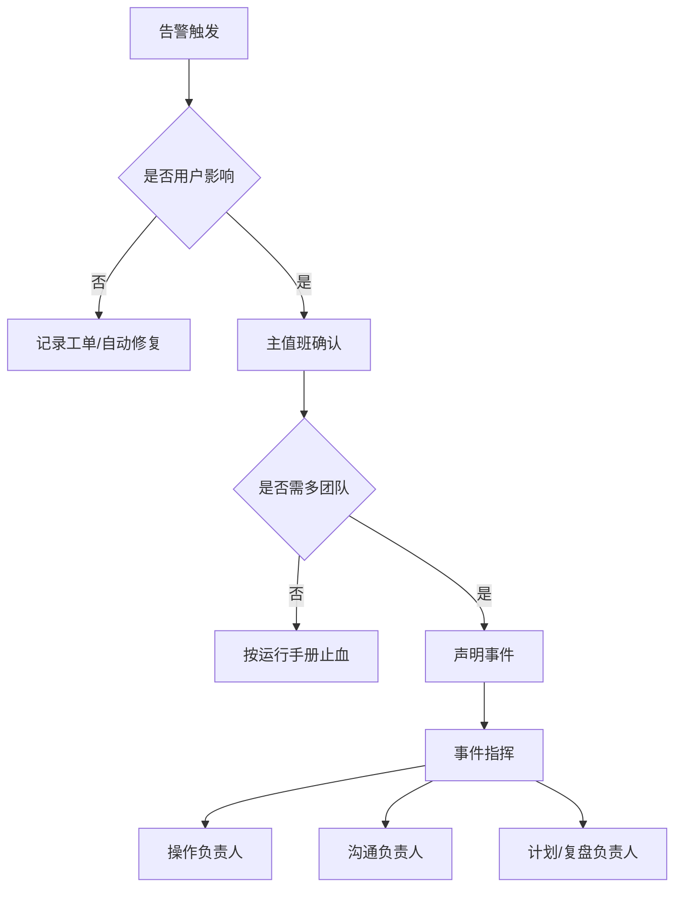

## 12.3 告警、值班与事件响应

### 12.3.1 告警必须指向动作

告警不是监控系统的通知功能，而是把用户风险转交给值班人员的契约。Prometheus 官方说明中，Prometheus 服务器根据告警规则生成 alerts，并由 [Alertmanager](https://prometheus.io/docs/alerting/latest/overview/) 负责去重、分组、静默、抑制和路由。FDE 项目的告警应优先基于 SLO、错误预算消耗和关键业务动作，而不是为每个机器指标设置阈值。一个可唤醒人的告警必须说明影响范围、判断依据、推荐动作、升级路径和静默条件；如果值班人员收到告警后只能继续翻仪表盘猜测，它就是噪声。

| 告警类型 | 适合唤醒 | 推荐处理 | 反例 |
| --- | --- | --- | --- |
| SLO 快速燃烧 | 是 | 立即分级、止血、升级 | 只报 CPU 90% |
| 单实例失败且有冗余 | 否 | 工单或自动修复 | 夜间叫醒 |
| 安全或数据泄露信号 | 是 | 进入安全事件流程 | 普通日志告警 |
| 发布观察窗口退化 | 视影响 | 暂停、回滚、降级 | 发布后无人看 |

### 12.3.2 值班要有权限、边界和保护

值班不是让最懂系统的人长期背锅，而是组织承诺：有人在明确时间内接收风险，有权限采取止血动作，有机制获得支援。值班手册应写清主值班、备值班、业务联系人、客户联系人、供应商联系人，以及哪些操作可以直接执行、哪些必须审批。Google SRE 在处理 operational load 时强调值班与中断管理需要机制化；现场团队也应限制夜间非紧急噪声，保证轮值可持续。FDE 项目还要特别处理客户现场权限：如果值班人员没有生产访问权、没有降级开关、不能联系网络或数据库团队，所谓 7x24 只是形式。

### 12.3.3 事件响应先恢复，再复盘

Google 的 [Incident Management Guide](https://sre.google/resources/practices-and-processes/incident-management-guide/) 强调准备、可靠告警、明确 on-call 流程，以及基于 Incident Command System 的协调、沟通和控制。一次事件中，最危险的不是没人努力，而是多人同时无协调地改生产系统。事件流程应明确 Incident Commander、Operations Lead、Communications Lead；操作只从一个通道进入，沟通按节奏更新，状态文档记录时间线、影响、假设、动作和结果。恢复阶段优先止血：回滚、降级、限流、切换、关闭非关键功能。若事件涉及入侵、凭证泄露、数据泄露、合规报告或客户安全承诺，则进入安全事件响应分支：先保护证据和审计日志，限定影响范围，执行遏制、凭证轮换、隔离或下线，并让安全、隐私、法务或合规 owner 确认对外通知和恢复条件；不得为了快速恢复而覆盖取证材料或扩大泄露面。根因分析和长期修复必须在服务恢复后进行，并形成无责复盘、行动项、负责人和到期日。FDE 项目要把复盘交付给客户能理解的事实链，而不是只给内部技术结论。

事件台账是运行证据的一部分，最低字段包括 incident_id、SEV、开始/发现/声明/恢复/关闭时间、影响范围、客户沟通记录、关键动作、执行人、变更关联、数据或权限影响、残余风险、行动项 owner 和到期日。没有台账，事件响应会停留在聊天记录里，无法支撑客户复盘或后续审计。

### 12.3.4 SEV 分级表

事件分级决定唤醒范围、沟通节奏和复盘要求。FDE 现场应与客户 Owner 在上线前对齐下表，避免事件中临时争议。

| 级别 | 影响范围 | 人员唤醒 | 客户沟通节奏 | 复盘要求 |
| --- | --- | --- | --- | --- |
| SEV-0 | 全站不可用、数据丢失、安全/合规事件、客户承诺被违反 | 全员唤醒，含管理层和安全；安全事件由安全负责人主导 IR 分支 | 立即首报，每 15–30 分钟更新，恢复后正式书面通报 | 强制无责复盘 + 客户级行动项与到期日；安全/合规事件补证据保全、影响范围、通知和补救记录 |
| SEV-1 | 核心业务严重受损或大范围降级；存在升级风险 | 主备值班 + 业务/平台/客户 Owner | 30 分钟首报，每 30–60 分钟更新 | 强制复盘 + 行动项与回归测试 |
| SEV-2 | 核心业务效率受影响但有人工兜底；无数据/越权风险 | 主值班，必要时业务 Owner | 工作时间内通报，按需更新 | 简化复盘 + 至少一条改进项 |
| SEV-3 | 局部噪声、可观察异常、轻微体验影响 | 工单内处理，无需唤醒 | 周报或月报合并通报 | 记录到趋势看板，是否复盘按团队判断 |

### 12.3.5 事件案例：模型切换后审批建议变差

背景：2025 年 5 月 14 日（周三）10:00，团队将采购审批 Agent 的主模型从 `model-a` 切换到 `model-b`，提示词版本保持 `approval-v17`，目标是降低延迟和 token 成本。发布观察窗口内，技术调用成功率仍为 99.9%，但业务侧“审批建议可审核通过率”从 96% 降到 88%，人工复核退回率明显升高。

| 环节 | 处理内容 |
| --- | --- |
| 告警 | 10:18，`ApprovalRecommendationQualityDrop` 触发：15 分钟窗口内可审核通过率低于 92%，且人工退回率高于基线 2 倍；同一 trace 维度显示异常集中在 `model-b`。 |
| 影响范围 | 影响采购金额大于 5 万元的自动审批建议，约 18% 新建审批单进入人工复核队列；没有自动放行错误，客户最终审批权限未被绕过。 |
| SEV | 定为 SEV-2：核心业务效率受影响并可能扩大，但无数据丢失、无越权审批、无全站不可用。 |
| Incident Commander | 当班 FDE Tech Lead 担任 Incident Commander；Operations Lead 负责回滚和指标验证；Communications Lead 负责客户状态更新。 |
| 首要止血 | 10:24 暂停 `model-b` 全量流量，将高金额审批建议切回 `model-a + approval-v17`；低金额场景继续影子运行 `model-b`，但不进入业务建议结果。 |
| 客户沟通 | 10:30 向客户审批运营负责人发送首次更新：说明影响范围、已采取回退、无自动放行风险、下一次更新时间；后续每 30 分钟同步一次恢复指标。 |
| 恢复验证 | 10:45 外部合成用例通过；11:05 可审核通过率回到 95% 以上并保持 30 分钟；人工复核队列积压清零后，Incident Commander 宣布服务恢复。 |
| 复盘行动项 | 1. 为模型切换增加影子评估门槛：关键金额段通过率不得低于基线 1 个百分点；2. 将模型版本、提示词版本、工具调用链、输入输出 token、缓存命中写入审批建议 trace；3. 在运行手册中补充“模型回退”和“事后评估提示词回退/修订”的分支，事故中不得临时改生产提示词；4. 为客户报告增加“生成成功”和“可审核通过”的分离指标；5. 一周内复核 `model-b` 失败样本，决定是否调整提示词或保留仅影子模式。 |
| 复盘记录 | 事件时间线、指标截图、客户沟通记录和行动项保存到客户约定的 incident 目录，并关联到对应变更单。 |
