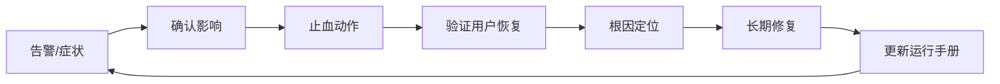

## 12.4 变更风险与运行手册

### 12.4.1 大多数事故来自变更

现场系统的风险高峰通常出现在发布、配置调整、数据迁移、证书轮换、权限变更、模型切换、依赖升级和容量扩缩时。Google SRE 的[发布工程](https://sre.google/sre-book/release-engineering/)强调自助化、高速度、封闭构建和强工具化，核心原因是规模化发布不能依赖人工记忆。FDE 项目应把每次变更视为受控实验：明确变更目的、影响面、回滚路径、观察指标、审批条件和暂停条件。越靠近客户核心流程，越不能用“只是改个配置”降低标准。

| 变更类型 | 主要风险 | 必要控制 |
| --- | --- | --- |
| 应用发布 | 缺陷放大到真实用户 | 金丝雀、自动回滚、发布观察 |
| 配置变更 | 即时全局生效 | 分环境、审计、版本化 |
| 数据迁移 | 不可逆写入、语义漂移 | 备份、校验、双写对账 |
| 数据产品变更/质量失败 | 契约破坏、质量门阻断、消费者误用 | 契约版本、质量门、血缘影响分析、消费者通知、回滚/重放窗口 |
| 权限调整 | 越权或阻断业务 | 最小权限、到期、复核 |
| 模型/规则切换 | 输出行为变化 | 影子评估、人工抽检、回退 |

### 12.4.2 运行手册写给压力下的人

运行手册不是知识库文章，而是事故压力下可以执行的操作脚本。它应从症状入口组织：告警名称、用户现象、影响判断、首要止血动作、诊断命令、回滚步骤、升级联系人、验证方式和复盘记录位置。每一步都应可复制、可审计、可撤销；危险动作要标注前置条件和预期结果。Grafana Synthetic Monitoring 在 [checks 文档](https://grafana.com/docs/grafana-cloud/testing/synthetic-monitoring/create-checks/checks/)中提到检查结果可保存为 Prometheus metrics 和 Loki logs，并用于 Grafana alerting 与 incident management；这类合成检查可以直接成为运行手册中的“外部用户视角验证”。

### 12.4.3 运行手册模板

每个会唤醒值班人员的告警，都应有一份对应运行手册。模板可以保持统一，但内容必须具体到当前系统、环境和权限边界。

| 字段 | 写法要求 |
| --- | --- |
| 告警名 | 使用监控系统中的精确名称，例如 `ApprovalRecommendationQualityDrop`。 |
| 触发条件 | 写清窗口、阈值、维度和排除条件，例如“15 分钟可审核通过率低于 92% 且样本数大于 50”。 |
| 确认命令 | 给出可复制命令、仪表盘链接或查询语句，并说明正常结果长什么样。 |
| 首要止血动作 | 优先选择可逆动作，例如暂停流量、关闭开关、降级、限流、切回上一版本。 |
| 回滚步骤 | 写清回滚对象、执行人权限、命令或控制台路径、预期耗时和失败处理。 |
| 验证方式 | 包含内部指标、外部合成检查、业务抽样和客户侧确认口径。 |
| 升级联系人 | 列出主值班、备值班、业务负责人、客户联系人和供应商联系人。 |
| 数据治理 | 写清本手册会查看或保存的截图、日志、trace、工单和客户反馈的敏感级别、脱敏/最小化、访问角色、保留期和删除责任人。 |
| 禁止操作 | 明确事故中不得执行的动作，例如不得直接修改生产数据、不得清空队列、不得关闭审计日志。 |
| 复盘记录位置 | 写清事件时间线、截图、沟通记录、样本和行动项保存位置。 |

如果运行手册包含 break-glass 操作，必须写清授权人、最长有效期、可执行动作、禁止动作、审计字段、事后回收步骤和补普通变更单的时限。break-glass 不是“临时绕过流程”，而是带 TTL、带证据、带复核的受控例外。

运行手册还应包含“何时声明事件”和“何时解除事件”的判定条件。只要需要跨团队协调、存在客户影响或需要客户沟通，就不应停留在个人排障状态。

### 12.4.4 手册必须演练和版本化

没有演练的运行手册，通常会在事故中暴露三个问题：命令过期、权限不足、联系人失效。FDE 团队应把运行手册作为交付物版本化，与架构、部署和权限变更同步更新；每次真实事件后，必须把缺失步骤补回手册。关键手册要定期演练，尤其是回滚、灾备切换、密钥轮换、数据恢复和客户通知。演练不是表演成功，而是发现不可执行之处。运行手册还应避免绑定个人经验：如果只有某位专家能理解步骤，说明手册仍未完成。最终目标是让一名合格值班人员在有限上下文下也能安全止血，并把系统交还给后续修复流程。

### 12.4.5 运行手册示例：审批建议变差时怎么处理

以下示例把 12.3.5 案例（采购审批 Agent 从 `model-a` 切到 `model-b` 后，可审核通过率从 96% 降到 88%）按模板字段端到端填写。

| 字段 | 内容 |
| --- | --- |
| 告警名 | `ApprovalRecommendationQualityDrop` |
| 触发条件 | 滚动 15 分钟窗口内，金额≥5 万元的审批建议样本量≥50，且可审核通过率 < 92% 或人工退回率 > 基线 2 倍；按 trace 维度 `model_version` 区分。 |
| 确认命令 | 打开仪表盘 `dash/approval-agent-quality`，按 `model_version` 分组看可审核通过率；查询 `sum by (model_version) (rate(approval_recommendation_passed_total[15m])) / sum by (model_version) (rate(approval_recommendation_total[15m]))`；正常值≥0.95。 |
| 首要止血动作 | 1) 在模型网关把 `purchase_amount>=50000` 的流量从 `model-b` 切回 `model-a + approval-v17`；2) 对 `model-b` 启用影子模式（不影响业务结果）。两步均为可逆开关，无需发布。 |
| 回滚步骤 | 在 `gateway-config` 仓库执行 `git revert <切换 commit> && argocd sync gateway-prod`；执行人需 `gateway-admin` 角色；预计耗时 5 分钟；失败时手动在控制台将 `routing.purchase_approval.model` 改回 `model-a`。 |
| 验证方式 | 合成用例 `approval-quality-canary` 全绿；可审核通过率连续 30 分钟≥95%；人工复核队列积压清零；客户运营 Owner 抽检 5 条建议确认无异常。 |
| 升级联系人 | 主值班：FDE Tech Lead（PagerDuty 队列 `fde-primary`）；备值班：平台 SRE on-call；业务负责人：客户采购运营经理；客户联系人：客户 IT Ops 值班；供应商：模型供应商 enterprise support 工单入口。 |
| 数据治理 | 涉及审批建议的 trace 和 failed 样本标为 `confidential`；只保存脱敏输入、证据 ID、模型/提示版本、工具轨迹和人工处理结果；访问限 FDE on-call、客户采购运营 Owner 和平台 SRE；保留 90 天或客户合同约定周期；删除责任人为客户数据 Owner。 |
| 禁止操作 | 不得在事件中调整 `approval-v17` 提示词；不得清空人工复核队列；不得直接修改已落库的审批结论；不得关闭 trace 采样。 |
| 复盘记录位置 | `incidents/2025/<事件号>/` 目录下保存时间线、指标截图、客户沟通记录、failed 样本与行动项清单，并在变更单 `CHG-<id>` 中反向链接。 |
| 何时声明事件 | 触发条件持续 10 分钟未自愈，或客户 Owner 主动反馈影响业务 → 声明 SEV-2 事件。 |
| 何时解除事件 | 业务指标恢复并稳定 30 分钟，且无新增退回 → 由 Incident Commander 宣布恢复，进入复盘阶段。 |
