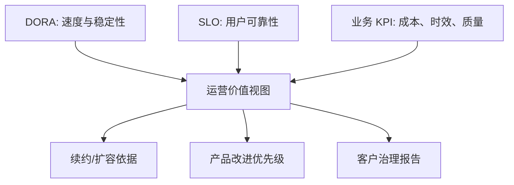

## 12.5 运营指标与价值证明

### 12.5.1 运营指标要连接业务结果

FDE 现场交付最终要证明价值，而不是证明团队很忙。运营指标应从客户关心的结果反推：处理时长是否下降，人工接管是否减少，失败重试是否降低，关键流程是否更稳定，审计证据是否更完整，变更是否更安全。OpenTelemetry 的可观测性入门把 SLO 视为把可靠性传达给组织的方式，并强调将 SLI 与业务价值连接；这正是 FDE 汇报运营价值的基础。仪表盘不应只展示技术健康，还要展示服务对业务动作的影响。

| 指标层次 | 代表指标 | 证明的问题 |
| --- | --- | --- |
| 技术健康 | 可用性、延迟、错误率、饱和度 | 系统是否可靠运行 |
| 交付效率 | 发布频率、变更前置时间、自动化比例 | 团队是否更快交付 |
| 稳定性 | 变更失败率、失败部署恢复时间、错误预算消耗 | 速度是否带来风险 |
| 业务结果 | 周转时间、一次通过率、人工接管率 | 客户是否得到价值 |
| 治理证据 | 审计完整率、手册覆盖率、复盘关闭率 | 能否被交接和审查 |

### 12.5.2 DORA 指标不能孤立使用

Google Cloud 在[介绍 Four Keys 的文章](https://cloud.google.com/blog/products/devops-sre/using-the-four-keys-to-measure-your-devops-performance)中将 DORA 早期核心四项指标概括为部署频率、变更前置时间、变更失败率和恢复服务时间。DORA 的[指标指南](https://dora.dev/guides/dora-metrics/)已将当前五指标模型调整为：change lead time、deployment frequency 和 failed deployment recovery time 归入 throughput；change fail rate 和 deployment rework rate 归入 instability。现场报告应说明采用的是历史 Four Keys 还是当前五指标，避免把旧 MTTR / time to restore service 与 failed deployment recovery time 混用。

| DORA 指标 | 维度 | 现场解释 |
| --- | --- | --- |
| 部署频率（deployment frequency） | 吞吐量 | 单位时间内生产部署次数或部署间隔。 |
| 变更前置时间（change lead time） | 吞吐量 | 从代码提交到生产部署需要多久。 |
| 变更失败率（change fail rate） | 不稳定性 | 部署后需要立即干预、回滚或热修的比例。 |
| 失败部署恢复时间（failed deployment recovery time） | 吞吐量 | 在 DORA 软件交付指标口径中，失败部署从触发到恢复生产需要多久，收窄并替代旧 MTTR / time to restore service 口径；事故响应团队仍可在自己的 SRE/ITSM 口径中继续使用 MTTR 或恢复时间。 |
| 部署返工率（deployment rework rate） | 不稳定性 | 因生产事件触发的非计划部署占比。 |

这套口径适合观察工程系统是否变得更高效，但不能替代业务结果。一个 FDE 团队可能部署更频繁，却没有减少客户运营成本；也可能让失败部署恢复更快，却没有解决根本流程缺陷。因此应把 DORA 指标、SLO 指标和客户业务 KPI 放在同一张经营视图中，避免工程局部最优。

### 12.5.3 价值证明要有基线和反事实

价值证明最忌只报上线后的绝对数字。上线前应建立基线：人工处理平均多久，异常率是多少，每月事故多少次，审计取证需要多久，发布失败造成多大影响。上线后再用同口径窗口比较，并说明季节性、业务量变化、流程变更和外部依赖。对自动化和 AI 场景，还要区分“系统完成”和“结果可接受”：自动生成了建议不等于业务采纳，减少人工步骤不等于降低风险。FDE 团队应把运营报告做成决策材料：哪些指标证明价值，哪些指标暴露风险，谁负责决策，触发什么动作，何时复核，下一阶段应该投资可靠性、效率、覆盖范围还是治理能力。这样，运维不再是成本中心，而是现场价值持续兑现的证据系统。
