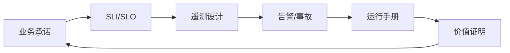

# 第十二章：可观测性与现场运维

FDE 项目进入生产现场后，真正的难点不再是“系统能否部署成功”，而是“系统能否被长期理解、控制和证明价值”。客户现场通常同时存在遗留系统、云服务、第三方接口、人工流程和组织边界。一次失败可能来自代码缺陷，也可能来自数据漂移、容量误判、权限变更、外部依赖、发布窗口或操作失误。没有可观测性，团队只能在事故中猜测；没有运行机制，团队只能靠少数专家记忆维持服务。

可观测性可以建立在指标、日志和链路追踪等遥测信号之上，这一点可参考 [OpenTelemetry](https://opentelemetry.io/docs/concepts/observability-primer/)；可靠性管理则可参考 [Google SRE](https://sre.google/sre-book/service-level-objectives/) 对 SLI、SLO 和错误预算的论述。对 FDE 而言，这些实践的价值不是引入更多工具，而是把“用户是否得到承诺结果”变成可测量、可告警、可复盘、可改进的工程闭环。现场运维的逻辑顺序应始终保持一致：先明确业务承诺，再定义 SLI/SLO，然后设计遥测，基于遥测组织告警和事故响应，把可执行动作固化为运行手册，最后用运营指标证明价值。本章文件顺序先说明遥测问题域，再正式定义 SLO，是为了让读者看到遥测要服务什么问题；工程实施时仍应从业务承诺和 SLO 反推遥测。

本章按这条链路展开：如何从业务承诺提炼 SLI/SLO，如何设计指标、日志、追踪和 Agent/GenAI 观测字段，如何组织告警、值班和事件响应，如何用运行手册降低操作风险，如何把 DORA、SLO 和业务 KPI 转化为客户能接受的价值证明，以及如何把 token 成本与多租户归因纳入同一套观测体系。
