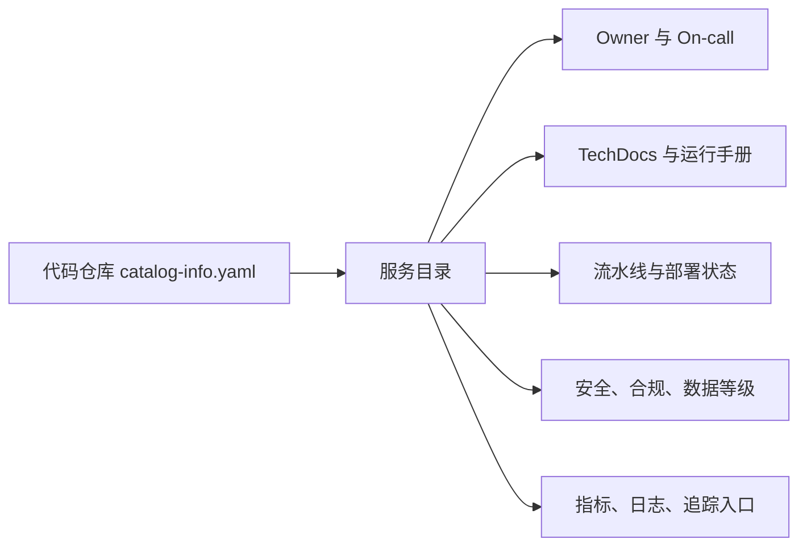

## 13.1 开发者门户与服务目录

### 13.1.1 门户是工程事实入口

FDE 团队进入客户现场后，最先遇到的混乱通常不是代码，而是事实分散：服务名在仓库、告警、仪表盘、运行手册、云资源和工单系统中各不相同；一个接口出了问题，没人能立刻判断负责人、依赖方、数据等级和发布历史。开发者门户的价值，是把这些事实组织到一个可搜索、可扩展、可审计的入口。它不是“内部导航页”，而是平台的索引层。

开发者门户的服务目录可参考 [Backstage Software Catalog](https://backstage.io/docs/features/software-catalog/) 的做法：用源代码中的 metadata YAML 作为组件元数据来源，并让团队通过正常 Git 流程维护服务元数据。官方文档还说明，任何软件都可以注册为组件，包括服务、网站、库、数据管道和外部 SaaS；通过 Backstage Software Templates 创建的软件会自动进入目录。这个模型适合 FDE：服务目录不依赖某个中央管理员手工录入，而是让所有权、生命周期、依赖、文档和交付入口跟随代码演进；运行状态、SLO、成本和安全证据则应从运行系统、流水线和治理工具同步，不应手工写死在目录里。

### 13.1.2 服务目录要回答生产问题

一个可用的服务目录至少要回答六类问题。第一，谁负责：owner、业务联系人、值班组、升级路径。第二，它是什么：类型、生命周期、业务能力、接口、数据域。第三，它依赖谁：上游、下游、数据库、队列、外部 API。第四，它现在怎样：SLO、告警、最近部署、运行环境。第五，如何变更：模板、流水线、审批、回滚入口。第六，风险在哪：权限边界、数据分类、暴露面、合规证据。

| 目录字段 | 平台用途 | 现场风险 |
| --- | --- | --- |
| owner、system、domain | 责任归属与组织边界 | 事故时找不到负责人 |
| lifecycle、tier | 发布策略与 SLO 分层 | 关键系统按实验系统治理 |
| dependsOn / dependencyOf | 影响分析与变更评审 | 下游中断才发现依赖 |
| runbook、dashboard | 值班入口 | 告警后只能问专家 |
| data_classification | 权限与审计 | 敏感数据被错误暴露 |

门户建设要避免两个极端：一是把目录当资产盘点，字段很多但没人维护；二是把门户当万能控制台，把所有工具 UI 嵌进去却没有统一模型。正确做法是从关键工作流反推目录字段：新服务创建、事故响应、发布审批、依赖变更、安全审查和交接培训。凡是不能驱动动作的字段，都应谨慎加入；凡是能降低等待和误判的入口，都应优先接入。

商业 Internal Developer Platform / Portal（IDP，内部开发者平台/门户）市场近两年快速成熟；这里的 IDP 不是 Identity Provider。FDE 选型时应明确：客户是否有自建运维能力、是否已有 SaaS 采购通道、是否需要深度自定义，并按“门户/目录”“平台编排”“治理/scorecard”分组评估。下表是截至 2026-05-18 的公开定位摘要；产品功能、定价和托管边界变化快，采购前必须复核官方文档和合同条款。

| 平台 | 定位 | 托管模型 | 典型成本口径 |
| --- | --- | --- | --- |
| [Backstage](https://backstage.io/) | 开源 IDP 框架，需自建插件与运维 | 自托管 | 有平台工程团队，希望深度定制 |
| [Humanitec](https://humanitec.com/) | 以 Platform Orchestrator、资源图和 Terraform/OpenTofu 模块编排为主；Score 可作为工作负载规格入口 | SaaS / 自托管 | 多云、多环境差异大，需自动生成应用配置 |
| [Port](https://www.port.io/) | 高度可配的开发者门户，目录 + 自助操作 | SaaS | 想快速落地门户、不愿运维 Backstage |
| [Cortex](https://www.cortex.io/) | 服务目录 + Scorecard 工程健康度评估 | SaaS | 需要可量化的工程成熟度治理 |

Backstage、Port、Cortex 主要覆盖门户、目录和治理体验；Humanitec 更偏平台编排、动态配置和环境生成，可接入这些门户。它们在自托管能力、定价（按服务数 / 用户数）、AI 辅助和 Scorecard 上各有侧重；FDE 评估时应让客户先列出强制需求（合规、私网部署、与 ServiceNow / GitHub / GitLab 集成），再判断 SaaS 是否合规可用。

一个典型事故场景可以这样落地。第一，告警系统把 `service`, `environment`, `slo`, `trace_id` 和告警规则链接带入门户，值班人员不用再猜服务名。第二，在服务目录中打开该组件，确认 owner、on-call 组、业务联系人和升级路径，若一级值班未响应，按目录里的升级链路通知负责人。第三，进入同一组件的 runbook 和 dashboard，查看已知故障模式、关键指标、日志和追踪入口。第四，查看最近部署、配置变更、依赖版本和变更单，判断告警是否与刚发布的版本、特性开关或基础设施调整相关。第五，打开依赖图，识别下游服务、数据管道、队列和外部 API，先通知受影响 owner，再决定是否降级、限流或暂停下游任务。第六，若需要升级处理，在门户中发起事故升级：关联告警、runbook 步骤、最近部署、依赖影响、回滚候选版本和当前证据，让指挥、开发、数据和客户团队看到同一事实。
