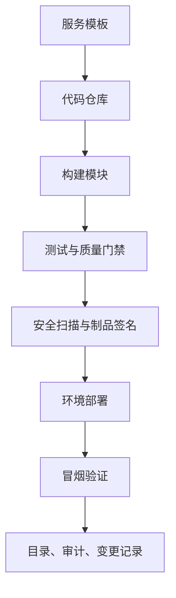

## 13.2 交付平台与模板化

### 13.2.1 模板化把经验变成默认路径

交付平台的目标不是替代 CI/CD 工具，而是把组织认可的工程路径变成默认选项。FDE 团队常在不同客户、云环境、合规约束和遗留系统之间切换，如果每个项目都重新设计仓库结构、构建脚本、镜像策略、权限申请、观测接入和发布流程，交付质量会依赖少数资深工程师记忆。模板化的价值，是让新服务从第一天就带有目录元数据、测试框架、容器构建、基础告警、部署配置、运行手册和安全检查。

模板化入口可参考 [Backstage Software Templates](https://backstage.io/docs/features/software-templates)：模板可以加载代码骨架、收集参数并发布到 GitHub 或 GitLab 等位置。对 FDE 而言，模板不应只生成代码骨架，还应生成平台契约：`catalog-info.yaml`、SLO 初稿、最小权限、环境变量规范、OpenTelemetry 接入、发布策略和回滚说明。模板越接近生产真实路径，后续治理越少依赖补救。

模板输出要明确“谁维护、何时校验”，否则生成物很快失真。

模板族不应只覆盖 Web/API 服务。FDE 平台至少要区分四类 golden path：API 服务模板输出接口契约、SLO、观测和回滚；数据管道模板输出数据契约、freshness/quality 检查、血缘和重跑策略；批处理/业务工作流模板输出幂等、补偿、超时和人工介入；AI agent/RAG 模板输出权限矩阵、索引契约、eval suite、trace schema、工具注册表和人审策略。不同模板共享生产契约，但测试、评测和运行手册必须按风险面分开。

| 模板输出 | 生成内容样例 | 维护责任 | 校验时机 |
| --- | --- | --- | --- |
| `catalog-info.yaml` | 组件名、owner、system、domain、lifecycle、依赖、文档链接 | 服务 owner 维护，平台团队维护 schema | 模板 dry run、合并前检查、生产发布前 |
| SLO 初稿 | 可用性目标、延迟目标、错误预算、告警路由 | 服务 owner 与 SRE 共同维护 | 首次上线评审、季度运行复盘、SLO 变更时 |
| 最小权限 | 服务账号、云资源角色、数据库权限、密钥访问范围 | 服务 owner 申请，安全或平台策略校验 | 环境创建、权限变更、生产发布前 |
| OpenTelemetry | trace、metrics、logs SDK 配置，资源属性和采样默认值 | 平台团队维护默认接入，服务 owner 调整业务标签 | 构建检查、集成环境冒烟、生产告警接入 |
| SBOM | 依赖清单、镜像摘要、许可证和漏洞扫描入口 | 构建平台生成，服务 owner 处理例外 | 每次构建、制品签名、发布门禁 |
| 回滚说明 | 回滚命令、数据兼容性、特性开关、不可逆迁移说明 | 服务 owner 维护，发布经理或 SRE 复核 | 每次生产变更、演练、事故复盘 |

### 13.2.2 流水线要可编程、可复用、可验证

传统流水线容易在 YAML 中堆积条件分支，最后变成难以测试的隐式程序。可编程流水线可参考 [Dagger](https://docs.dagger.io/) 的设计：其官方文档把 Dagger Functions 描述为由类型安全 SDK 编写、打包在模块中的计算单元，并强调可以“write pipelines in code, not YAML”。这类思路适合把交付动作拆成可复用模块：构建镜像、生成 SBOM、运行契约测试、扫描漏洞、发布到临时环境、执行冒烟测试、注册服务目录。平台团队维护模块，业务团队调用模块；差异通过参数表达，而不是复制粘贴流水线。

把流水线写成代码不自动带来治理收益。FDE 采用 Dagger 或类似能力前，应先确认模块 owner、版本发布策略、缓存/密钥边界、CI runner 权限、制品存储、失败日志脱敏和本地/CI 一致性；否则只是把难维护的 YAML 迁移成难维护的程序。

| 平台能力 | 模板输出 | 门禁检查 |
| --- | --- | --- |
| 服务创建 | 仓库、目录元数据、运行手册 | owner、生命周期、数据等级 |
| 构建发布 | 镜像、制品、版本号 | 可重复构建、依赖锁定 |
| 质量控制 | 单测、契约测试、冒烟测试 | 覆盖关键路径 |
| 安全治理 | SBOM、扫描、签名 | 高危漏洞和权限漂移 |

模板化不是冻结技术选择。优秀的平台应允许团队在受控边界内选择语言、框架和部署形态，但必须统一不可协商的生产契约：可观测性、可回滚性、可审计性、依赖声明、权限最小化和数据保护。这样，平台提供速度，治理提供边界，团队仍保留解决业务问题的自由。
