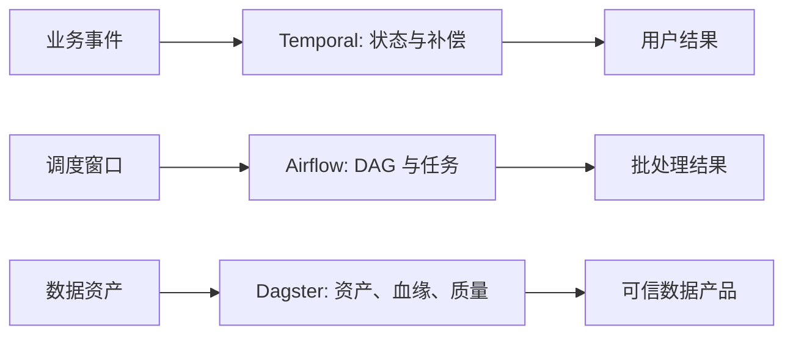

## 13.3 工作流与数据编排

### 13.3.1 先区分业务工作流和数据编排

FDE 项目里，“工作流”常被混用。业务工作流关注长周期状态：客户开户、订单履约、审批、补偿、人工确认和跨系统事务；数据编排关注数据资产：抽取、转换、质量校验、训练集生成、报表刷新和特征发布。两者都需要依赖、重试和可观察性，但失败语义不同。业务工作流要保证状态不丢、动作不重复、人工介入可恢复；数据编排要保证数据血缘清楚、调度窗口明确、资产质量可验证。

业务工作流可参考 [Temporal](https://docs.temporal.io/) 官方文档强调的 crash-proof execution：应用在崩溃、网络故障或基础设施中断后，可以从中断处继续执行，适合订单、支付、审批、客户 onboarding 等关键流程。数据编排可参考 [Airflow](https://airflow.apache.org/docs/apache-airflow/stable/core-concepts/overview.html) 的 DAG 模型，任务按显式依赖、调度区间和运行状态执行；Airflow 3 已把 Dataset 语义演进为 Asset，并支持 asset-aware scheduling，但它仍更偏 DAG/工作负载优先。以资产思考数据、把数据表、模型特征、报告和下游消费关系纳入统一资产图的做法，可参考 [Dagster](https://docs.dagster.io/)；当资产图、血缘、质量和 owner 是主要抽象时，Dagster 更适合做数据产品控制面。

Airflow 的 Asset Event 能表达“某个资产已更新并可触发下游”，但它不是事务边界，也不能替代数据质量、幂等和消费者通知。资产事件的权限同样敏感：谁能发布事件，谁就可能触发依赖该资产的下游 DAG，因此多租户现场要把事件发布权限纳入治理。

### 13.3.2 编排工具要按失败模式选择

工具选择的第一性问题不是“哪个更流行”，而是失败后要恢复什么。若一个流程跨多个外部系统、需要等待人工审批、可能运行数小时或数天，并且不能因为 worker 重启而丢状态，Temporal 这类 durable execution 更合适。若任务以定时批处理为主，依赖关系清晰，失败后可以重跑某个任务、某个 DAG run 或由资产更新触发下游任务，Airflow 的 DAG、scheduler 和 worker 模型更直观。若团队的核心痛点是“哪些数据资产过期、谁依赖它、质量检查在哪失败”，Dagster 的资产视角更能减少数据平台混乱。

| 场景 | 推荐抽象 | 关键设计点 |
| --- | --- | --- |
| 长事务、审批、补偿 | Durable workflow | 幂等 activity、确定性 workflow、状态可恢复 |
| 定时批处理、任务依赖 | DAG | 调度窗口、重试策略、任务粒度 |
| 数据产品、特征、报表 | 数据资产 | 血缘、质量检查、元数据、所有权 |
| AI 评测与索引刷新 | 混合编排 | 数据版本、模型版本、失败回放 |

编排平台上线前，要先定义运行契约：任务是否幂等，外部副作用是否可补偿，重试会不会重复扣费或重复写入，人工审批是否有超时和升级路径，数据资产是否有 freshness 和质量阈值。编排工具能让复杂流程可见，但不能替团队补上业务语义。没有幂等性、所有权和质量口径，任何漂亮的 DAG 图都会在生产中变成事故地图。

以“客户开户 + 数据校验 + 人工审批 + 报表刷新”为例，不应强行用同一个工具吃掉全部问题。客户开户主流程适合 Temporal：创建客户档案、调用 KYC 服务、等待人工审批、补偿失败的外部调用、处理超时升级，这些步骤有长周期状态、外部副作用和恢复要求。数据校验和报表刷新适合 Airflow 或 Dagster：每日同步客户主数据、执行质量规则、刷新开户漏斗报表、发布给 BI 或风控模型，这些任务有明确调度窗口、数据血缘和可重跑语义。人工审批可以由 Temporal 等待审批结果，但审批页面、权限和审计应接入门户与治理系统，而不是把人机交互硬塞进数据 DAG。

混用的边界是事件和数据资产。Temporal 在“客户开户完成”“审批拒绝”“开户超时”时发布业务事件；Airflow 或 Dagster 订阅事件或按窗口读取已落库状态，生成数据资产和报表。这样，业务流程失败时恢复业务状态，数据任务失败时重跑数据资产；两边通过清晰契约连接，而不是让 Temporal 承担批量数据血缘，或让 Airflow/Dagster 承担不可丢状态的客户交易。
