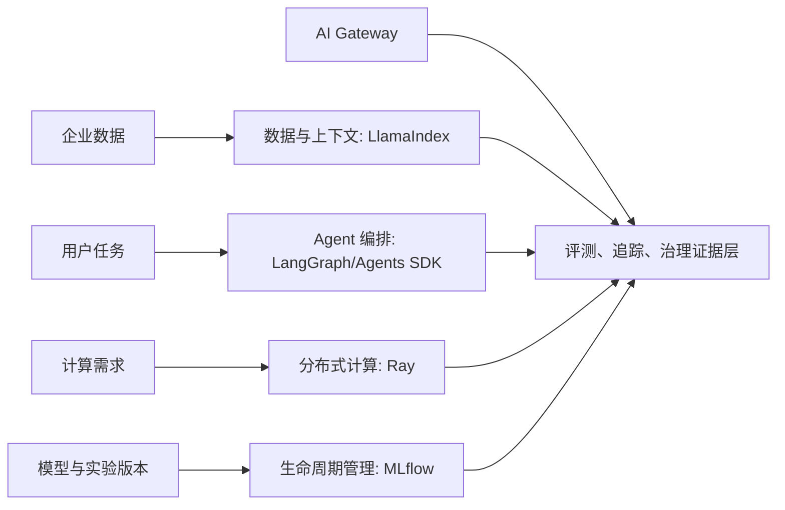

## 13.4 AI 工程工具链

### 13.4.1 AI 工具链要覆盖上下文、编排、计算和生命周期

AI 原生 FDE 项目不能只接一个模型 API。生产系统通常包含文档解析、索引、检索、提示、agent 状态、工具调用、评测、模型选择、推理、成本和回滚。工具链要让模型行为可复现、可评估、可追踪、可治理。

AI 工具链可按上下文、编排、计算和生命周期分层选择。上下文增强、RAG、数据连接器和工作流能力可参考 [LlamaIndex](https://developers.llamaindex.ai/python/framework/)；LangGraph 的 [durable execution 文档](https://docs.langchain.com/oss/python/langgraph/durable-execution)说明，其持久化层可保存状态，支持中断恢复与 human-in-the-loop；文档也提醒应保持流程确定性、把副作用放入 task。分布式处理、训练、调参和服务可参考 [Ray](https://docs.ray.io/en/latest/ray-overview/index.html) 的 Ray Core、Ray Clusters 以及 Data、Train、Tune、Serve 等库；模型生命周期记录可由 [MLflow Tracking](https://mlflow.org/docs/latest/ml/tracking/) 记录 runs、datasets、artifacts、models，并通过 Tracking Server、Artifact Store 和 Model Registry 支撑协作。

### 13.4.2 LangGraph、LlamaIndex、Agents SDK 与 MCP 的分层

LLM 工程栈里几个常被并列的名词其实分属不同层，FDE 选型时要分开评估：

- **LlamaIndex** 在本书 FDE 栈中主要放在 **数据 / 上下文层**：负责文档解析、切分、索引、检索与引用证据，输出标准化的 chunks 与 retrievers，供上层 agent 调用；它也有 agent/workflow 原语，选型时要和 LangGraph、Agents SDK 的编排边界一起评估，避免同一层重复抽象。
- **LangGraph** 处于 **流程编排层**：用有状态图描述 agent 的步骤、分支、循环、人审与重试，提供持久化、checkpoint、time travel，可与任何模型供应商组合。
- **OpenAI Agents SDK** 处于 **agent 运行时层**：提供代码优先的 agent 运行时和编排 SDK，开发者声明 tools/handoffs，运行时负责模型调用、工具调用、多轮控制与追踪。
- **AI Gateway** 处于 **模型与策略控制层**：统一模型/provider API、路由、重试、fallback、预算/限流、guardrail、MCP/tool inspection、token 和成本归因，并把 model route、policy version、fallback path、guardrail result 和 trace_id 写入证据链。
- **MCP（由 Anthropic 发起，现由 AAIF / Linux Foundation 承接治理的开放协议）** 处于 **工具与上下文协议层**：MCP server 暴露工具、资源和提示；host 或 agent 框架中的 MCP client 负责消费这些能力，使外部系统不必绑定到某个模型 SDK。MCP 标准化访问方式，但不替代最小权限、用户 consent、工具 allowlist、scoped token、写动作人审、gateway 检查和审计。

简化的依赖关系：MCP 提供工具与数据接口 → LangGraph 在流程编排层消费 MCP 工具，Agents SDK 在 agent runtime 中消费 MCP 工具 → LlamaIndex 等通过 MCP 或框架原生接口提供数据上下文 → AI Gateway 在模型和工具边界执行路由、预算、策略和观测。FDE 常见误区是把它们当成竞品做单选，正确做法是按层组合，并保留替换某一层的能力。

### 13.4.3 生产 AI 平台要以证据闭环为中心

AI 工程平台的关键不是工具覆盖率，而是证据闭环。一次回答或自动动作必须能追溯到：模型、提示、索引、文档片段、工具、中间状态、评测结果、审批记录、成本和延迟归因。没有这些证据，评测无法解释，事故无法复盘，合规也无法成立。

| 层次 | 典型工具 | 平台交付物 |
| --- | --- | --- |
| 数据与上下文 | LlamaIndex | 连接器、解析、索引版本、引用证据 |
| Agent 编排 | LangGraph | 状态图、checkpoint、人审、恢复策略 |
| AI Gateway | LiteLLM / Envoy AI Gateway / Portkey / Kong AI Gateway 等 | provider/model 路由、预算/限流、fallback、guardrail、成本和 trace 证据 |
| 计算与服务 | Ray | 批处理、训练、调参、服务 |
| 生命周期 | MLflow | run、artifact、registry、评测记录 |
| 治理 | 门户与策略引擎 | 成本、权限、审计、回滚 |

平台团队应把 AI 工具链做成可组合能力，而不是强迫所有项目使用同一套模板。低风险问答可用轻量 RAG 与离线评测；高风险写入动作必须使用持久化状态、人审、审计和回放；大规模模型服务需要弹性层；模型迭代需要注册中心记录版本和指标。每次自动化提升，都必须同步提升可解释、可恢复和可治理能力。
