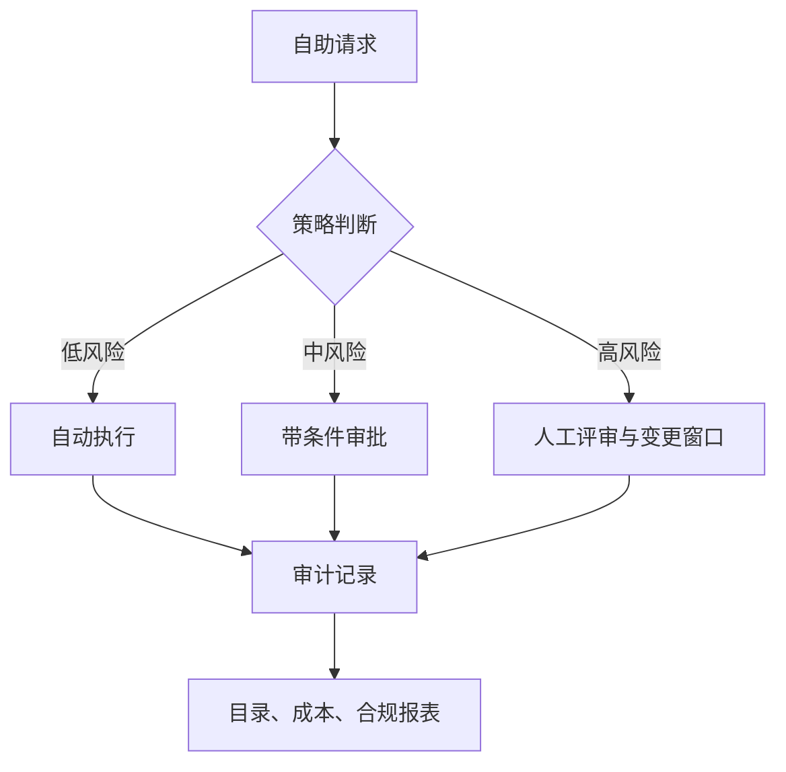

## 13.5 平台治理与自助能力

### 13.5.1 自助不是无审批，而是策略前置

平台化最容易失败的地方，是把自助能力误解为“谁都可以点按钮”。真正的自助，是把政策、模板、权限、配额、审计和回滚能力前置，让低风险动作即时完成，高风险动作进入清晰审批。FDE 现场通常要同时面对客户安全团队、内部平台团队、业务负责人和交付工程师；如果每个环境、账号、数据库、模型、密钥和外部接口都靠人工工单协调，速度会消失。如果完全放开，又会制造权限漂移、成本失控和合规风险。

治理应围绕平台契约设计，而不是围绕工具权限设计。目录和模板事实源负责 owner、数据等级、生命周期、SLO、模板版本和自助入口。运行时事实源负责变更窗口、回滚方式、观测信号、可恢复流程和审批记录。AI/模型事实源负责模型记录、提示版本、工具权限、风险等级和审计日志。Backstage 目录与模板、Dagger 模块、Temporal 或 LangGraph 的可恢复流程、MLflow 的模型记录，都可以成为治理事实来源，而不是孤立工具。

策略决策可以从应用代码中拆出来，用结构化输入做统一判断；这类通用策略引擎可参考 [Open Policy Agent](https://www.openpolicyagent.org/docs)。在 Kubernetes 场景，轻量准入可使用原生 ValidatingAdmissionPolicy/CEL；更复杂的策略生命周期、审计报告、mutation/generation、镜像校验或 Rego 复用，可用 [OPA Gatekeeper](https://www.openpolicyagent.org/docs/latest/kubernetes-introduction/) 或 [Kyverno](https://kyverno.io/docs/policy-types/cluster-policy/validate/)。关键不是选哪一个工具，而是把平台动作转换成一致的策略输入、审批记录和证据链。

```rego
package platform.governance

default allow := false

allow if {
  input.action == "create_resource"
  input.resource.owner
  input.resource.data_classification
  input.resource.cost_center
}

allow if {
  input.action == "deploy_production"
  input.change.tests_passed
  input.change.sbom_signed
  input.change.rollback_plan
  input.approval.change_id
}

allow if {
  input.action == "request_data_access"
  input.request.purpose
  input.request.expires_at
  input.approval.data_owner
}

allow if {
  input.action == "ai_agent_write"
  input.agent.tool in {"create_ticket", "update_runbook"}
  input.agent.risk_level == "low"
  input.audit.trace_id
}
```

该示例为治理意图伪代码，未经过 Rego v1 语法校验。生产部署可根据落点改写为 OPA 策略、OPA Gatekeeper Constraint、Kyverno ClusterPolicy、Kubernetes ValidatingAdmissionPolicy/CEL 或平台自助系统的策略单元。这段策略只表达平台治理意图，实际生产还要补充组织身份、租户边界、例外流程和测试用例。它的价值在于让“创建资源、发布生产、申请数据访问、AI agent 写操作”都经过同一种判断模型。



### 13.5.2 平台指标要衡量摩擦和风险

平台治理不能只报“接入了多少服务”。好的平台指标同时衡量效率、质量和风险：新服务从申请到可部署需要多久，模板生成后有多少手工修改，发布失败率是否下降，事故定位时间是否缩短，高危漏洞是否被阻断，权限例外是否按期回收，模型成本是否可归因，人工审批是否集中在真正高风险动作上。平台团队要像产品团队一样运营内部能力，把开发者体验和控制效果同时纳入复盘。

| 治理对象 | 自助能力 | 控制点 | 指标 |
| --- | --- | --- | --- |
| 服务创建 | 模板和目录注册 | owner、数据等级、SLO | 首次部署时长 |
| 环境与资源 | 配额化申请 | 成本中心、生命周期 | 闲置资源率 |
| 生产发布 | 标准流水线 | 测试、扫描、回滚 | 变更失败率 |
| 数据访问 | 用途化授权 | 最小权限、到期回收 | 权限例外数量 |
| AI 动作 | 工具权限与人审 | 风险分级、审计 | 未经批准写操作数 |

| 平台动作 | 策略检查 | 审批 | 审计证据 | 回滚证据 |
| --- | --- | --- | --- | --- |
| 创建资源 | owner、数据等级、成本中心、生命周期、配额 | 超配额或敏感资源需平台 owner 审批 | 资源规格、申请人、策略版本、决策结果 | Terraform plan、删除计划、资源 TTL |
| 发布生产 | 测试通过、SBOM 签名、漏洞阈值、回滚计划、变更窗口 | 高风险服务或冻结窗口需变更审批 | 制品摘要、流水线记录、变更单、策略决策 | 上一版本、回滚命令、数据库兼容性说明 |
| 申请数据访问 | 用途、数据分类、最小权限、到期时间、租户边界 | 敏感数据需 data owner 与安全审批 | 申请单、授权范围、到期时间、访问日志 | 权限回收记录、下游缓存清理证明 |
| AI agent 写操作 | 工具 allowlist、风险等级、上下文来源、写入范围 | 中高风险写操作需人审或双人确认 | agent trace、提示版本、工具调用、审批人 | 反向操作、变更 diff、工单或 runbook 历史 |

AI 证据资产也要治理：eval 样本、trace、prompt、检索片段、失败截图、人工反馈和红队 payload 都应标注敏感级别、脱敏/最小化、访问范围、保留期、删除责任、跨客户复用限制和审计日志。平台指标表中的每个指标还应有 owner、阈值、复审频率、触发动作和风险接受人；否则指标只会描述状态，不能驱动治理。

治理的成熟标志，是开发者愿意走平台路径，因为它更快、更清晰、更少返工；安全和运维团队也愿意信任平台路径，因为它保留了证据和控制。若平台只增加表单和审批，它会被绕过；若平台只追求速度而没有策略，它会成为风险放大器。FDE 的平台化应坚持一个边界：把重复、标准、可证明安全的动作自动化；把不确定、高影响、不可逆的动作显性化，并让决策留下证据。
