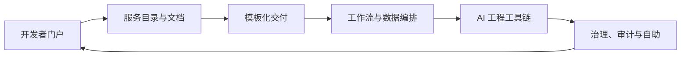

# 第十三章：工具生态与平台化

FDE 项目的交付速度，最终取决于团队能否把重复工作沉淀为平台能力。工具不是越多越好；工具生态的目标，是让开发者、数据工程师、运维、安全和业务团队在同一套事实、流程和边界上协作。开发者门户负责回答“系统在哪里、谁负责、如何接入”；交付平台负责把最佳实践固化为模板和流水线；工作流与数据编排负责让长周期任务可恢复、可观察；AI 工程工具链负责把模型、检索、评测和部署连接成闭环；平台治理负责在自助能力和风险控制之间建立秩序。

工具生态可以按能力边界组织：用 [Backstage Software Catalog](https://backstage.io/docs/features/software-catalog/) 汇聚服务元数据、所有权和插件能力；用 [Dagger](https://docs.dagger.io/) 把交付流程抽象为可复用的代码化函数和模块；用 [Temporal](https://docs.temporal.io/) 处理故障后可从中断处恢复的 durable execution；用 [Airflow](https://airflow.apache.org/docs/apache-airflow/stable/core-concepts/overview.html) 和 [Dagster](https://docs.dagster.io/) 分别覆盖任务 DAG 与数据资产视角；用 [LangGraph](https://docs.langchain.com/oss/python/langgraph/durable-execution)、[LlamaIndex](https://developers.llamaindex.ai/python/framework/)、[Ray](https://docs.ray.io/en/latest/ray-overview/index.html) 与 [MLflow](https://mlflow.org/docs/latest/ml/tracking/) 覆盖 agent 编排、上下文增强、分布式计算和模型生命周期管理。

本章讨论平台化的五个层次：开发者门户与服务目录、交付平台与模板化、工作流与数据编排、AI 工程工具链，以及平台治理与自助能力。核心观点是：平台不是替团队做决定，而是把正确决策变成低摩擦路径，把高风险动作变成可审计流程。

本章与前面几个工程章节的边界要清楚。第 6 章讨论 CI/CD 的流水线设计、质量门禁、发布策略和回滚实践；本章不重复展开具体流水线，而是讨论如何把这些实践封装成可复用的平台模板、模块和自助入口。第 7 章讨论数据工程、数据质量、血缘和数据产品；本章只讨论数据平台能力如何接入统一门户、目录、权限和编排。第 10 章讨论 LLMOps 的模型、评测、提示、检索、监控和成本闭环；本章关注这些能力如何被组织复制：谁维护模板，谁审批高风险动作，哪些证据进入目录、审计和治理流程。

因此，工具生态章的重点不是列工具清单，而是回答“如何把工具变成平台”：把服务目录、交付模板、工作流编排、数据资产、AI 工具链和策略治理整合成统一操作路径，让 FDE 经验可以跨客户、跨团队、跨项目复用。
