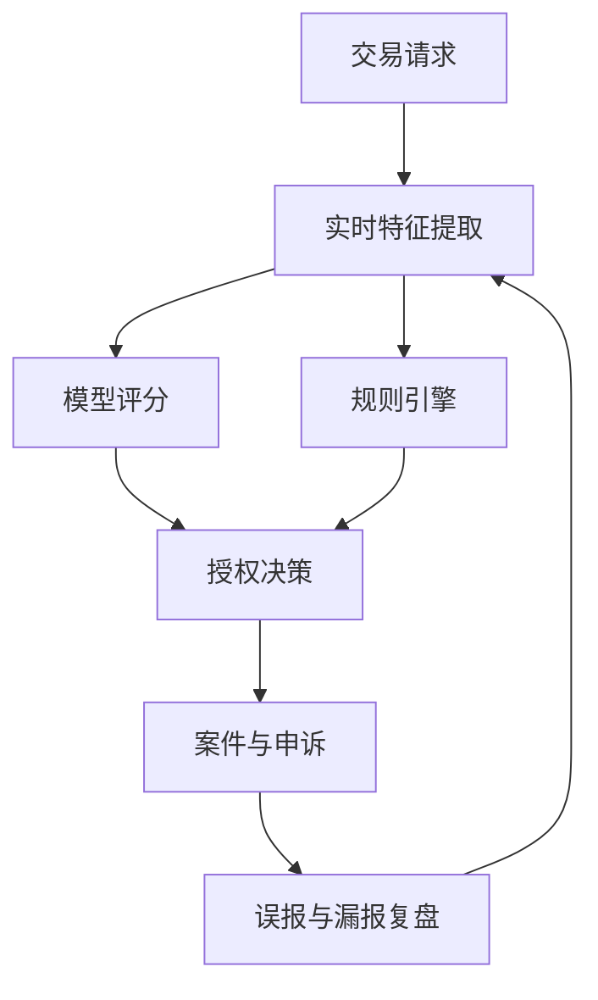

## 14.2 金融与风控

### 14.2.1 实时风控的工程本质

金融风控的现场压力来自交易速度、欺诈变化和客户体验之间的冲突。Visa 在 2024 年发布 [Visa Account Attack Intelligence Score](https://usa.visa.com/about-visa/newsroom/press-releases.releaseId.20661.html)，称其用于识别无卡交易中的枚举攻击，并为发卡机构提供实时风险评分；新闻稿披露该评分面向美国发卡机构先行推出，并可在授权决策中与规则引擎结合使用。这里的关键不是“有一个模型”，而是模型、规则、授权链路、异常解释、运营处置和客户申诉必须在毫秒级业务流中协同。

### 14.2.2 案例卡：Visa 如何识别枚举攻击

| 字段 | 内容 |
| --- | --- |
| 背景 | 枚举攻击会在无卡交易链路中批量试探卡号、有效期或安全码，攻击者一旦确认账户信息就可能快速转向欺诈交易。该案例来自 Visa 公开材料，非普遍收益承诺。 |
| 现场问题 | 风控系统既要在授权链路中足够快，又要避免把正常持卡人交易误判为攻击；发卡机构还需要把风险分数嵌入既有规则、客服、补卡和申诉流程。 |
| 部署动作 | 在 VisaNet 交易流中对无卡交易进行实时风险评分，把枚举风险作为授权决策输入，并可与发卡机构规则引擎共同使用。 |
| 关键取舍 | 不能只追求更高拦截率；误报会影响客户体验、客服负载和商户转化。部署重点是把模型分数、规则阈值、人工复核和客户补救动作连成闭环。 |
| 公开结果或预期指标 | Visa 公开材料称 VAAI Score 可在 20 毫秒内提供实时风险评分，并称相较其他风险模型误报率降低 85%。这些数字只适用于其材料所述产品和数据条件；本地复用应重新验证欺诈损失、误报率、授权延迟和客服工单变化。 |
| 不可外推边界 | 该案例不能证明所有欺诈类型都可用同一模型处理，也不能替代本地监管、数据授权、模型解释和申诉机制；地区、发卡策略、商户组合和攻击手法变化都会改变收益。 |

### 14.2.3 旁栏短例：Mastercard 如何用生成式 AI 辅助风控

Mastercard 的 [Decision Intelligence Pro](https://www.mastercard.com/news/press/2024/february/mastercard-supercharges-consumer-protection-with-gen-ai/) 公开介绍了用交易周边实体关系评估风险，并称相关技术在低于 50 毫秒内改进 DI 分数，初始建模显示欺诈检测率平均提升 20%、部分场景最高提升 300%。这同样来自公开材料，非普遍收益；FDE 复用时只能借鉴“图关系、实时评分、规则协同”的部署形态，不能把供应商建模结果当作自身上线指标。

### 14.2.4 风控部署回路

金融场景的可迁移原则是“先定义损失函数，再定义模型”。误杀会损害正常客户体验，放行会造成欺诈损失，二者都需要被度量。公开案例中提到的性能和收益应限定在其产品、区域和客户条件内使用；在自身环境复用时，必须重新校准数据分布、监管要求、延迟预算和人工复核流程。

FDE 在金融现场还要处理模型解释和责任分配。风控模型给出高风险评分，并不等于系统可以自动拒绝所有交易；业务策略、合规要求、客户分层和申诉渠道都可能影响最终动作。一个可交付系统应能说明：哪些特征参与判断，哪些规则覆盖模型，哪些交易进入人工复核，哪些操作写入审计日志，哪些指标用于监控误报和漏报。若这些链路缺失，模型越强，组织风险越大。

| 风控环节 | FDE 关注点 | 不可忽视的边界 |
| --- | --- | --- |
| 数据接入 | 实时性、质量、授权来源 | 不能混用未经授权数据 |
| 模型评分 | 可解释性、漂移、延迟 | 不能只看离线 AUC（离线样本上的区分能力指标） |
| 规则决策 | 策略 Owner、版本、例外 | 不能让规则长期无人维护 |
| 案件处理 | 复核效率、证据完整性 | 不能让用户无申诉路径 |
