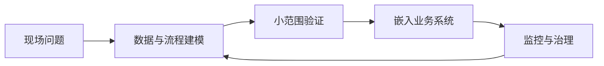

# 第十四章：行业实践案例

前线部署工程不是把通用软件交付给客户后离场，而是在真实业务环境中把问题、数据、流程、系统和组织约束连接起来。本章选取政府公共服务、金融风控、制造供应链、医疗生命科学，以及能源通信关键基础设施五类场景，重点观察三件事：一是团队如何进入现场并识别真实约束；二是工程系统如何嵌入既有业务流；三是案例中的收益、限制和风险如何被公开材料支撑，而不是被营销语言放大。

这些案例并不代表某个行业存在唯一正确路线。政府服务强调用户研究、合规和可审计治理；支付风控要求毫秒级响应和误杀控制；制造现场关注物料、设备和工艺数据的连续性；医疗生命科学必须把模型验证、临床流程和隐私保护放在交付之前；关键基础设施则把韧性、安全和人工监督置于效率之上。前线部署工程师的共同职责，是在这些差异化约束下，把抽象能力转化为可运行、可解释、可维护的现场系统。

本章只选择五类约束差异明显的行业作样本，不覆盖物流、国防、零售、SaaS、教育等全部场景。读者复用时应按约束原型迁移，而不是按行业名称迁移：监管责任、实时性、物理安全、资金风险、数据敏感度和人工授权边界，比“属于哪个行业”更决定部署方式。

| 小节 | 行业场景 | 主要工程问题 | 公开案例来源 |
| --- | --- | --- | --- |
| 14.1 | 政府与公共部门 | 政策、服务、用户反馈和敏捷治理协同 | [GOV.UK Service Manual](https://www.gov.uk/service-manual/agile)、[GDS](https://gds.blog.gov.uk/2018/04/26/gov-uk-a-journey-in-scaling-agile/) |
| 14.2 | 金融与风控 | 实时评分、误报控制、规则与模型协作 | [Visa](https://usa.visa.com/about-visa/newsroom/press-releases.releaseId.20661.html)、[Mastercard](https://www.mastercard.com/news/press/2024/february/mastercard-supercharges-consumer-protection-with-gen-ai/) |
| 14.3 | 制造与供应链 | 数字孪生、物料流、工艺变更和可追溯 | [Siemens 客户案例](https://resources.sw.siemens.com/en-US/case-study-roj/) |
| 14.4 | 医疗与生命科学 | 临床数据、AI 验证、药物研发和安全报告 | [Mayo Clinic](https://www.mayo.edu/research/centers-programs/robert-d-patricia-e-kern-center-science-health-care-delivery/research-activities/clinical-data-science)、[Pfizer](https://www.pfizer.com/news/press-release/press-release-detail/cytoreason-announces-expanded-collaboration-deal-pfizer) |
| 14.5 | 能源、通信与关键基础设施 | 自治网络、智能电网、韧性和人机协同 | [Ericsson DNB case](https://www.ericsson.com/en/cases/2024/digital-nasional-berhad-intent-based-operations)、[美国能源部](https://www.energy.gov/nepa/articles/cx-032183-cognitive-digital-twin-development-secure-and-resilient-smart-grid) |
| 14.6 | 公开失败案例 | 演示与生产脱节、模型直驱高影响动作、部署一致性缺失 | [JNCI Watson/MD Anderson 文章](https://academic.oup.com/jnci/article/109/5/djx113/3847623)、[Zillow investor release](https://investors.zillowgroup.com/investors/news-and-events/news/news-details/2021/Zillow-Group-Reports-Third-Quarter-2021-Financial-Results--Shares-Plan-to-Wind-Down-Zillow-Offers-Operations/default.aspx?stream=business)、[Air Canada 裁决](https://decisions.civilresolutionbc.ca/crt/crtd/en/item/525448/index.do)、[SEC Knight Capital](https://www.sec.gov/litigation/admin/2013/34-70694.pdf) |

本章阅读时应特别区分“案例已经公开证明的事实”和“可迁移的工程模式”。前者必须通过链接核验，后者需要结合自身行业的监管、数据质量、组织能力和风险承受度重新设计。
