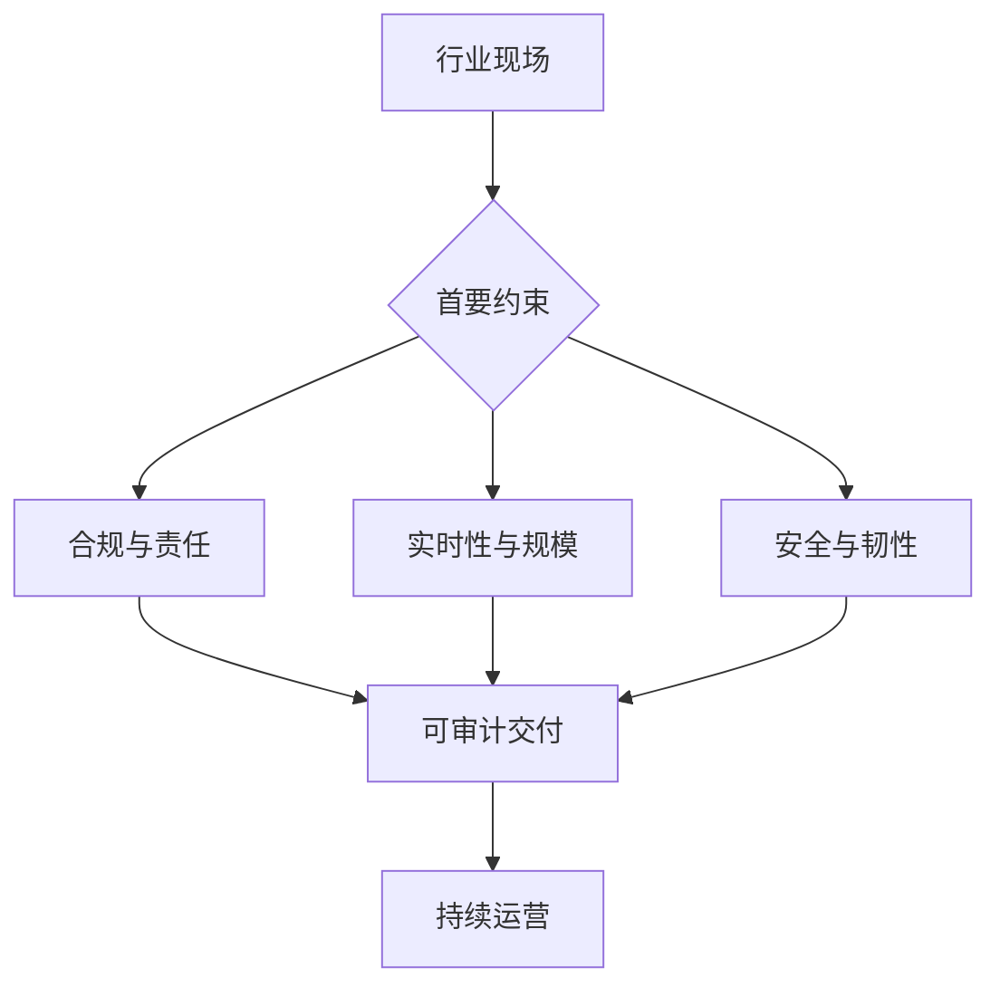

## 14.7 本章小结

第十四章不再把行业差异停留在约束速览，而是把五类行业拆成可复用但不可照搬的现场案例。共同点是：团队必须进入真实现场，理解数据从哪里来、决策由谁负责、系统失败会影响谁，并把软件能力嵌入现有流程。差异点是：公共部门可从 [GOV.UK](https://www.gov.uk/service-manual/agile-delivery/agile-government-services-introduction) 看到服务责任和可审计治理的重要性；金融风控可从 [Visa](https://usa.visa.com/about-visa/newsroom/press-releases.releaseId.20661.html) 与 [Mastercard](https://www.mastercard.com/news/press/2024/february/mastercard-supercharges-consumer-protection-with-gen-ai/) 案例看到毫秒级决策和误报控制的压力；制造场景可从 [Siemens ROJ](https://resources.sw.siemens.com/en-US/case-study-roj/) 案例看到设备和物料连续追踪的价值；医疗场景可从 [Mayo Clinic](https://www.mayo.edu/research/centers-programs/robert-d-patricia-e-kern-center-science-health-care-delivery/research-activities/clinical-data-science) 看到安全验证和临床责任的边界；关键基础设施则可从 [Ericsson DNB](https://www.ericsson.com/en/cases/2024/digital-nasional-berhad-intent-based-operations) 与[美国能源部](https://www.energy.gov/nepa/articles/cx-032183-cognitive-digital-twin-development-secure-and-resilient-smart-grid)材料看到韧性、安全和人工监督的要求。

### 14.7.1 案例复用条件表

| 案例 | 可复用前提 | 不能复用部分 | 上线前验证项 |
| --- | --- | --- | --- |
| GOV.UK Lasting Power of Attorney 服务 | 有明确服务负责人、真实用户研究、政策和法律边界可被转译为服务流程 | 英国法律流程、GDS 组织模式、具体表格和签署要求 | 完成率、退件率、求助量、办理时长、可访问性、申诉路径 |
| Visa VAAI Score 枚举攻击识别 | 有实时交易流、授权规则引擎、可标注欺诈和误报样本、客服补救流程 | VisaNet 数据、美国发卡机构先行条件、供应商公布的 20 毫秒和 85% 误报改善 | 授权延迟、误报率、漏报损失、规则覆盖、人工复核、客户通知和补卡流程 |
| Mastercard Decision Intelligence Pro 短例 | 有账户、商户、设备、地域和历史行为等关系数据，并能在授权链路中低延迟评分 | Mastercard 私有网络数据、供应商初始建模收益、具体生成式 AI 实现 | 图关系质量、评分延迟、欺诈检测提升、误杀影响、监管解释和漂移监控 |
| Siemens ROJ 数字孪生 | 设备、MES、仓储和物料数据可接入，且有一个明确的 NPI 或物料闭环 | ROJ 的电子制造工艺、Siemens/Cadlog 实施组合、公开客户案例收益数字 | 换线时间、停线等待、库存周转、过期物料、追溯完整率、设备接口稳定性 |
| 主案例：Mayo Clinic Control Tower 患者照护支持 | 有临床负责人、统一数据平台、可行动的专科队列和伦理/IRB/隐私合规/临床治理审批路径 | Mayo 的临床组织、姑息治疗流程、公开材料中的及时转诊和再入院改善数字 | 提醒阳性率、专家响应时间、咨询完成率、患者体验、误分流风险、退出机制 |
| 旁栏：Mayo Clinic AI-ECG 短例 | 有前瞻性或真实世界评估设计，能把模型输出嵌入临床决策支持而非自动诊断 | 试验人群、诊所网络、低射血分数场景和论文结果 | 外部验证、主要终点、医生采纳率、下游检查量、假阳性和假阴性处理 |
| 旁栏：Pfizer 药物安全短例 | 有清晰的不良事件摄取流程、药物警戒专家复核和监管报告责任链 | Pfizer 全球安全组织规模、具体平台、处理量和研发合作收益 | 有效报告判定、严重性分类、人工复核、审计日志、监管提交质量 |
| Ericsson DNB 意图驱动网络运营 | 网络拓扑、告警、配置、SLA 和客户体验数据可观测，且运维流程已有自动化基础 | DNB 多运营商核心网架构、Ericsson Operations Engine 实施路径、供应商发布的收益数字不可直接复用 | SLA 达成率、告警压缩率、变更失败率、回滚时间、人工接管频率 |
| 边界参考：DOE 智能电网认知数字孪生短例 | 能同时建模物理电力系统、通信、控制和运行状态，并有演练环境 | DOE 项目目标本身、任何未公开验证的可靠性收益 | 仿真保真度、控制边界、网络安全、故障模式、演练和人工授权 |

这些案例最重要的结论是：前线部署工程不是“把平台卖进客户现场”，而是把可运行系统与业务责任共同交付。工程师需要能够写代码、看数据、读流程、问风险，也要知道何时不自动化、何时保留人工确认、何时拒绝用缺乏证据的收益承诺推动上线。行业案例可以提供模式，但不能替代本地验证；每一次部署都应重新定义指标、风险、回退和维护责任。

任何案例复用前，都要把公开证据和本书推断分开，并写出 owner、上线阈值、回滚条件、复审触发和风险接受人。高影响自动化不得只因相似案例存在就跳过本地人工授权边界。
