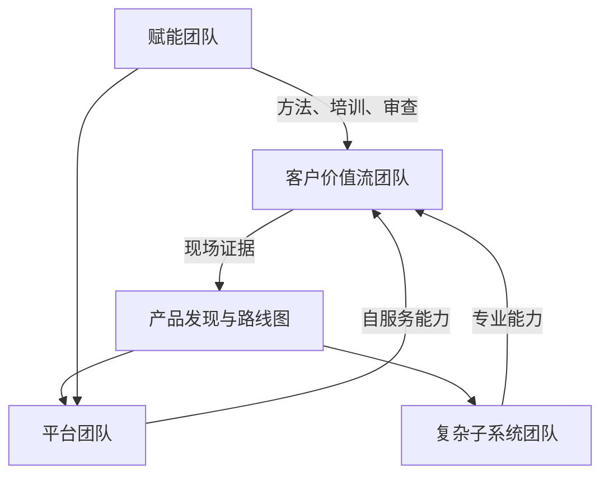

## 15.4 从项目制到产品组织

### 15.4.1 项目成功不等于产品成功

FDE 组织最常见的陷阱是把每次客户部署都当成独立项目。项目制关注范围、期限和验收，适合启动和证明价值；但如果所有知识都停留在项目里，组织会不断重复发现、集成、配置、培训和运维。产品组织关注可复用能力、长期运营、路线选择和用户结果。这个转变不是取消客户定制，而是区分“必须为现场适配的部分”和“应该沉淀成平台的部分”。产品发现可参考 [Atlassian 产品发现指南](https://www.atlassian.com/agile/product-management/discovery)中对理解客户需求和业务背景、并在构建前验证想法的定义；这正是 FDE 从个案进入产品的入口。现场反馈只有被整理成问题模式、使用证据、优先级和边界条件，才会变成产品资产。

| 维度 | 项目制 | 产品组织 |
| --- | --- | --- |
| 成功标准 | 按时交付和验收 | 持续使用、复用和业务结果 |
| 团队边界 | 围绕客户项目临时组队 | 围绕价值流和平台能力长期负责 |
| 知识形态 | 会议纪要和个人经验 | 路线图、组件、模板、评测集 |
| 预算逻辑 | 一次性交付成本 | 生命周期投入与回报 |
| 风险管理 | 上线前集中处理 | 从发现到运营持续控制 |

把项目需求转成平台能力，需要一个固定入口，而不是靠项目结束后的个人记忆。

| 步骤 | 要回答的问题 | 关键证据 |
| --- | --- | --- |
| 现场反馈采集 | 这是真问题还是一次性反馈 | 客户原话、失败截图、配置差异、集成阻塞、人工绕行、业务指标影响 |
| 归类 | 属于客户适配、行业共性、平台缺口、体验缺陷，还是运营/文档问题 | 重复出现的客户/团队、反例、监管和数据所有权差异 |
| 优先级排序 | 是否值得进入平台路线 | 影响客户数、减少工时、降低风险、实现复杂度、是否阻塞当前路线 |
| 路线图翻译 | 能否写成可复用能力 | 负责人、适用边界、不做什么、迁移计划、验收指标、复用场景 |
| 发布后验证 | 下一个部署是否更快、更稳、更少定制 | 采用项目数、首次接入时间、定制代码减少、重复缺陷下降、客户自治/接管时间 |

若一个能力发布后仍需要大量手工解释和项目分叉，说明抽象边界或自服务体验仍然不足。项目到产品的闭环，只有在下一个部署确实更快、更稳、更少定制时才算完成。

### 15.4.2 组织结构应服务价值流

组织结构可以借用 [Team Topologies](https://www.atlassian.com/devops/frameworks/team-topologies) 的思想：把团队分为面向价值流的团队、平台团队、复杂子系统团队和赋能团队，并让平台团队帮助价值流团队以更高自治度交付。FDE 组织可以据此设计：现场团队贴近客户价值流，负责发现、部署和反馈；平台团队提供身份、数据、评测、可观测性、工作流和部署基础能力；复杂子系统团队处理模型、优化、仿真、数据治理等高专业度问题；赋能团队把安全、产品发现、运行成熟度和 AI 评测方法带给更多团队。小团队早期可以一人兼多种角色，但责任仍要分清；随着规模和风险上升，再把角色拆成长期团队。这样设计的目标不是画漂亮组织图，而是减少等待、重复和认知负荷，让现场问题能更快进入可复用能力。

### 15.4.3 度量要连接交付流与产品结果

从项目制转向产品组织后，度量也要改变。只看项目毛利、工时利用率或验收数量，会鼓励团队把所有差异都留在客户项目里。更好的度量应同时覆盖交付流、产品复用和运营结果。高绩效技术组织的度量可参考 [DORA](https://dora.dev/research/) 的持续研究，它强调以用户为中心和保持优先级稳定对组织成功的重要性；其[软件交付指标](https://dora.dev/guides/dora-metrics/)已从早期 Four Keys 扩展为五项，包括 deployment rework rate。FDE 可以在此基础上增加现场特有指标：部署模式复用率、客户自治/接管时间、上线后人工介入率、平台缺口关闭周期、从现场反馈到产品发布的时间。每个产品化指标都应有定义公式、owner 和误用防护，例如“复用率”不能鼓励把不合适的客户强行塞进通用模板，“自治/接管时间”不能鼓励提前撤出 FDE 支持。产品化不是把所有东西做成通用功能，而是让下一个客户少付一次相同的学习成本。
