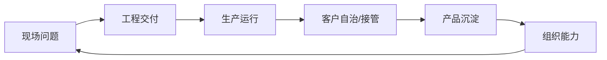

# 第十五章：组织能力与职业发展

FDE 不是单个“万能工程师”的神话，而是一种组织能力：把真实业务现场、产品平台、工程交付、可靠运行和专业伦理连接成可复制的工作系统。随着 AI 采用扩大、数据平台进入更多企业流程，但试点进入核心流程的成熟度仍不均衡，FDE 的价值不再只是快速完成一个客户项目，而是帮助组织识别可规模化的部署模式、把现场经验反馈到产品，并让客户团队最终能够独立运行。

公开岗位说明给出了组织能力的共同信号（快照日期见[快变事实核验表](../appendix/volatile_facts.md)）：从研究突破到生产系统的转化可参考 [OpenAI 的 FDE 岗位说明](https://openai.com/careers/forward-deployed-engineer-nyc/)，嵌入战略客户并把可复用部署模式反馈给产品工程可参考 [Anthropic 的 FDE 岗位说明](https://job-boards.greenhouse.io/anthropic)，招聘标准、培养框架、生产卓越和平台能力则可参考 [Scale AI 的 FDE 管理岗位说明](https://scale.com/careers/4690504005)。这些岗位说明共同显示 FDE 能力模型必须同时覆盖工程深度、业务理解、现场判断、产品抽象和组织学习；本书据此提出后续组织建议。

本章讨论五个主题：FDE 能力模型，招聘、培养与梯队，现场伦理与专业边界，从项目制到产品组织，以及个人职业路径与成长方法。目标是回答一个现实问题：当一个组织同时追求速度、质量、复用和责任时，FDE 应如何被选择、培养、管理和评价。
