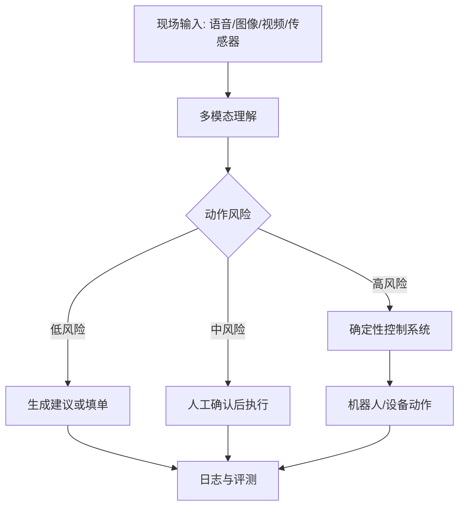

## 16.2 多模态与机器人现场交付

### 16.2.1 多模态改变现场输入

传统 FDE 多处理文本、表格、日志、接口和会议纪要；多模态模型把现场输入扩展到语音、图像、视频、屏幕、传感器和空间状态。实时语音交互、转写和工具调用可参考 OpenAI 的 [Realtime API 文档](https://developers.openai.com/api/docs/guides/realtime)，实时、音频、图像等能力也在其[模型文档](https://developers.openai.com/api/docs/models)中的多模态/实时模型家族里持续演进。对 FDE 来说，意义不只是“能听能看”，而是现场事实可以更接近原始发生方式：设备面板、操作视频、仓库货位、客服语音、施工照片、巡检记录都可能成为工程输入。

但多模态不是自动可靠。图像识别会受光照、角度、遮挡、分辨率和标注口径影响；语音会受噪声、口音、术语和多人打断影响；视频和传感器会引入成本、隐私、存储和延迟问题。FDE 应避免把多模态作为炫技入口，而要先定义业务动作：识别异常、辅助验收、远程指导、自动填单、质量复核、机器人调度，哪一个动作需要哪种输入，错误会造成什么后果。

### 16.2.2 机器人把交付带入物理世界

机器人现场交付会让 FDE 面对更硬的边界：物理安全、实时控制、设备维护、网络覆盖、环境变化和人工协作。开源机器人基础设施已形成可复用生态，例如 [ROS 文档](https://docs.ros.org/) 提供 ROS 2、包索引、Docker 镜像、Gazebo 和 Open-RMF 等开发资源。可以推断，多模态模型会更多进入机器人工作流，承担场景理解、任务分解、自然语言交互和异常解释；但底层运动控制、避障、安全停机和设备状态机仍应由确定性系统承担。

FDE 的长期机会，是把物理现场数字化为可治理工作流：输入可追溯、判断可评测、动作可回滚或可停止、责任可分配。其边界也必须清楚：在安全关键场景中，模型只能作为感知和建议层，不能绕过安全控制链路直接驱动设备。

因此，多模态和机器人不会削弱现场工程，反而会提高现场工程门槛。团队需要同时理解模型能力、传感器误差、网络条件、设备协议、作业安全和人类操作习惯。未来更有价值的 FDE，不是能把聊天界面接到摄像头的人，而是能判断哪些物理动作可以自动化、哪些必须人工确认、哪些场景必须保持机械和软件双重保护的人。

短案例：制造/仓储现场希望减少夜班巡检漏检。团队在货架通道部署固定摄像头和手持终端，巡检员可以拍摄托盘照片、口述“第三排疑似破损、温控灯闪烁”，系统把图像、语音转写、货位编码和历史工单合并成巡检候选事件。模型负责识别破损包装、堵塞通道、异常指示灯和语音中的设备编号，但 FDE 明确把误识别风险写进流程：低置信度、遮挡严重、涉及停线或安全隔离的结果必须人工确认；只有“补拍照片、创建工单、提醒复核”这类低风险动作可自动执行。机器人可以移动到指定货位、调整摄像头角度、上传更多证据，但不能直接拉闸、搬运危险品或解除安全锁。结果是漏检率下降、工单证据更完整，代价是高风险动作仍保留人工确认阈值和机械安全链路。这种取舍看似降低自动化程度，实际提高了客户愿意长期运行系统的可信度。
