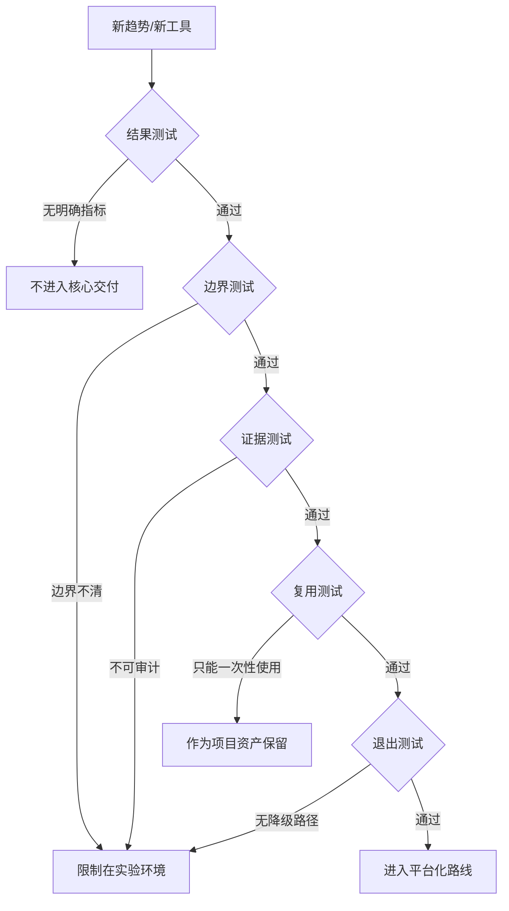

## 16.5 判断长期价值

### 16.5.1 不用新奇性衡量未来

趋势判断最容易犯的错误，是把技术热度当成长期价值。FDE 面对 AI FDE、多模态、机器人、开源协议和合规自动化时，不能只问“是否先进”，而要问“是否让现场结果更可持续”。一个能力只有同时改善业务结果、工程可维护性、组织采用和治理证据，才值得进入核心交付体系。否则它可能只是一次成功演示：短期让客户兴奋，长期增加依赖、成本和责任不清。

长期价值应从反事实开始评估：如果不引入这项能力，问题会如何继续发生；如果引入，哪个瓶颈被消除；如果模型、供应商或政策变化，系统是否还能运行；如果 FDE 离开，客户团队是否能维护。这个判断比 ROI 表更硬，因为它直接面对可持续性。OpenAI 和 Palantir 的代理能力说明工具执行正在增强，但官方资料同时强调工具、上下文、权限、trace、审批和治理；这意味着可控性本身就是价值的一部分，而不是上线后的补丁。

### 16.5.2 长期价值的五个测试

FDE 可以用五个测试筛选未来能力。第一，结果测试：它是否改善一个明确业务指标，而不是只提升体验感。第二，边界测试：它是否有清楚的输入、输出、权限、失败模式和回滚方式。第三，证据测试：它是否能自动留下评测、日志、审批和运行记录。第四，复用测试：它是否能沉淀为模板、组件、协议或方法，而不是一次性定制。第五，退出测试：当模型不可用、成本上升或供应商变化时，系统是否有降级路径。

任何进入平台路线的新能力，都应先写一页决策备忘录：事实来源与核验日期、要验证的假设、目标业务指标、输入/输出/权限边界、证据字段、owner、TCO 基线、复审日期和退出路径。没有这份备忘录，趋势判断容易从工程决策滑向采购偏好或演示偏好。

反例：某团队把一个会议纪要 Agent 快速接入客户项目管理系统，演示时能自动总结讨论、创建任务、提醒负责人，看起来节省了 FDE 的会后整理时间。但按五个测试复盘，它没有通过任何一项：结果测试上，只统计了“生成任务数”，没有证明延期率或返工率下降；边界测试上，Agent 可以读取所有项目空间并创建任务，却没有区分建议、草稿和正式任务；证据测试上，没有保存原始会议片段、任务生成依据和人工修改记录；复用测试上，提示词写死了该客户的组织称谓和项目字段；退出测试上，一旦模型费用上升或接口停用，团队没有人工回填流程和历史映射。正确处理方式不是扩大试点，而是退回到草稿模式，先补指标、权限、日志、模板和降级路径。

对未来的合理态度，是积极但不迷信。可以推断，FDE 的角色会被 AI 显著增强，部分低层交付动作会被代理承担；但客户现场最稀缺的仍是判断力：知道该解决什么、何时停止、谁承担责任、哪些证据足以交付、哪些局部成功不应产品化。长期价值不是工具替代人，而是让人把工程判断放在更高杠杆的位置。

最后，还要警惕“平台化幻觉”。不是每个现场需求都值得沉淀为平台能力，也不是每个自动化都值得长期维护。判断长期价值时，应把维护成本、责任成本、培训成本和退出成本一并计算。只有当某项能力能被多个团队复用，并且复用不会掩盖关键差异时，它才适合进入平台路线；否则，把它保留为项目经验、模板或案例，反而更符合 FDE 的工程理性。
