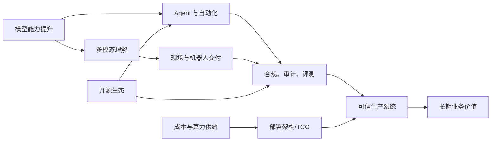

# 第十六章：趋势与未来

FDE 的未来不应被理解为“更多工具替代人”，而应被理解为现场交付边界的重新分配：模型和代理承担更多检索、生成、变更草拟、验证和运维辅助工作；FDE 则把精力转向问题定义、系统边界、治理证据、价值判断和组织采用。这个方向已经有现实基础：例如工具调用、文件搜索、网页搜索和计算机使用等 agent 基础能力可参考 [OpenAI Responses API](https://openai.com/index/new-tools-for-building-agents/)；把自然语言请求转成 Foundry 内的数据管道、Ontology、代码仓库和治理操作的路径可参考 [Palantir AI FDE](https://www.palantir.com/docs/foundry/ai-fde/overview)。

但趋势不是命运。多模态模型、机器人、开源 agent 框架、AI 治理标准和合规自动化都在快速演进，许多能力仍受成本、可靠性、权限、责任和组织接受度约束。本章讨论六类变化：AI FDE 与自动化代理如何改变工程分工，多模态与机器人如何把现场交付推进到物理世界，合规自动化和可信 AI 如何成为生产准入条件，开源生态会带来哪些机会与风险，FDE 如何判断一项新能力是否具备长期价值，以及推理成本与算力供给如何重塑部署架构。后续趋势都用五个测试审查：结果、边界、证据、复用和退出；第 16.5 节会把这套判断正式展开。

本章所有未来判断都按两层表达：已经公开发布、可由官方资料核查的能力写成事实；对行业走向、角色变化和组织影响的判断写成推断，并保留适用条件。
